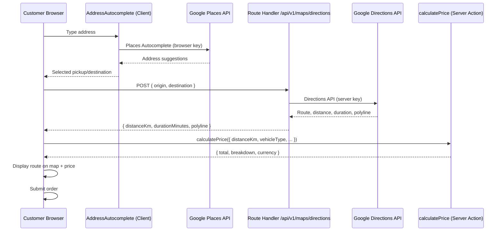
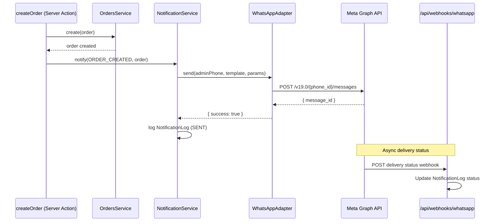
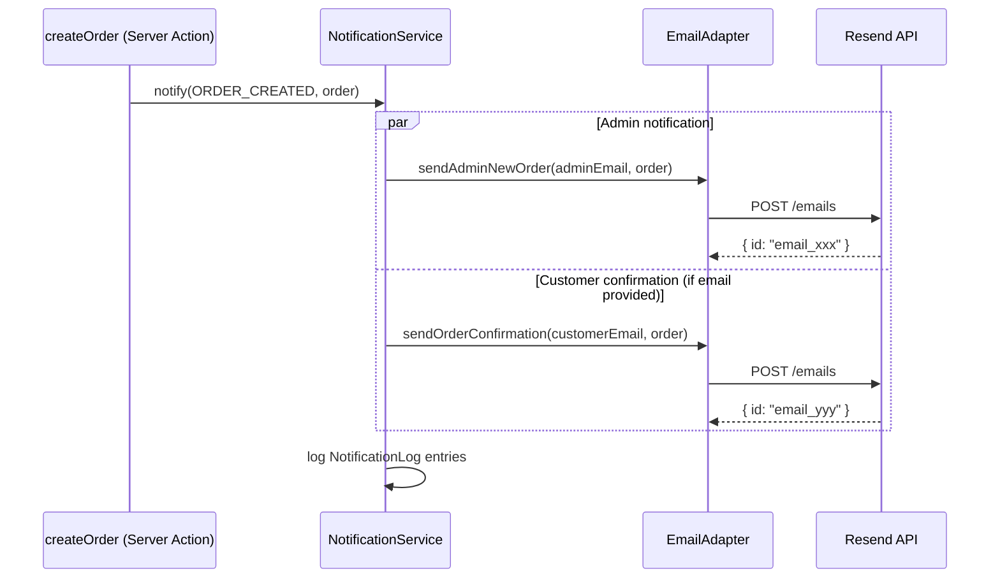

# Tow Truck Service Platform — API Specification

**Version:** 1.0  
**Status:** Draft — Pending Approval  
**Phase:** 5 — API Specification  
**Last Updated:** 2026-08-03  
**Base URL:** `{NEXT_PUBLIC_APP_URL}` (e.g., `https://example.com`)

---

## Table of Contents

1. [API Architecture](#1-api-architecture)
2. [Validation Strategy](#2-validation-strategy)
3. [Authentication Flow](#3-authentication-flow)
4. [Authorization Rules](#4-authorization-rules)
5. [Response Format](#5-response-format)
6. [Error Codes & Status Codes](#6-error-codes--status-codes)
7. [Server Actions — Public](#7-server-actions--public)
8. [Server Actions — Admin](#8-server-actions--admin)
9. [Route Handlers](#9-route-handlers)
10. [Shared Schemas](#10-shared-schemas)
11. [API Versioning Strategy](#11-api-versioning-strategy)
12. [Rate Limiting Strategy](#12-rate-limiting-strategy)
13. [Logging Strategy](#13-logging-strategy)
14. [Security Considerations](#14-security-considerations)
15. [Google Maps Integration Flow](#15-google-maps-integration-flow)
16. [WhatsApp Business Integration Flow](#16-whatsapp-business-integration-flow)
17. [Email Notification Flow](#17-email-notification-flow)
18. [Endpoint Index](#18-endpoint-index)
19. [Approval Checklist](#19-approval-checklist)

---

## 1. API Architecture

### 1.1 Overview

The platform uses a **dual-surface API architecture** within the Next.js modular monolith:

| Surface | Technology | Used For |
|---------|-----------|----------|
| **Server Actions** | Next.js `"use server"` functions | All mutations and most reads initiated from UI |
| **Route Handlers** | Next.js `app/api/**/route.ts` | External callbacks, file downloads, API proxies, cron |

```
┌─────────────────────────────────────────────────────────────────────┐
│                           CLIENT LAYER                               │
│  Public Booking UI          Admin Dashboard UI         External APIs │
└──────────┬──────────────────────────┬──────────────────────┬────────┘
           │                          │                      │
           ▼                          ▼                      ▼
┌──────────────────────┐  ┌──────────────────────┐  ┌─────────────────┐
│   SERVER ACTIONS     │  │   SERVER ACTIONS     │  │ ROUTE HANDLERS  │
│   (Public)           │  │   (Admin, auth-gated)│  │ (External-facing)│
│                      │  │                      │  │                 │
│  calculatePrice      │  │  updateOrderStatus   │  │  POST /maps/*   │
│  createOrder         │  │  upsertPricingRule   │  │  GET  /export   │
│  validateServiceArea │  │  updateSettings      │  │  POST /webhooks │
│  getPublicSettings   │  │  getDashboardStats   │  │  GET  /cron/*   │
└──────────┬───────────┘  └──────────┬───────────┘  └────────┬────────┘
           │                          │                       │
           └──────────────────────────┼───────────────────────┘
                                      ▼
                        ┌─────────────────────────┐
                        │    DOMAIN SERVICES       │
                        │  Orders · Pricing · Maps │
                        │  Settings · Notifications│
                        └────────────┬────────────┘
                                     ▼
                        ┌─────────────────────────┐
                        │   PostgreSQL (Prisma)   │
                        └─────────────────────────┘
```

### 1.2 Design Principles

1. **Server Actions are the primary API** — type-safe, CSRF-protected, no REST boilerplate.
2. **Route Handlers only where necessary** — external webhooks, binary downloads, third-party proxies.
3. **Thin entry points** — Actions/Handlers validate input, check auth, call domain services, return typed responses.
4. **No direct Prisma in Actions** — all database access through module repositories.
5. **Shared Zod schemas** — single source of truth for validation across client forms and server.
6. **Ukraine-first defaults** — phone (+380), currency (UAH), locale (uk) enforced in schemas with country-independent extensibility.

### 1.3 File Organization

```
src/
├── actions/
│   ├── order.actions.ts          # Public + admin order actions
│   ├── pricing.actions.ts        # Public price calc + admin pricing CRUD
│   ├── settings.actions.ts       # Public settings read + admin settings write
│   ├── service-area.actions.ts   # Admin service area CRUD
│   ├── holiday.actions.ts        # Admin holiday CRUD
│   ├── analytics.actions.ts      # Admin dashboard stats
│   ├── notification.actions.ts   # Admin notification log reads
│   ├── admin-user.actions.ts     # Admin user management (SUPER_ADMIN)
│   └── auth.actions.ts           # Login/logout wrappers
├── modules/
│   └── {module}/
│       └── {module}.schema.ts    # Zod schemas (shared validation)
└── app/api/
    ├── auth/[...nextauth]/route.ts
    ├── v1/maps/directions/route.ts
    ├── v1/maps/distance/route.ts
    ├── v1/maps/config/route.ts
    ├── webhooks/whatsapp/route.ts
    ├── admin/export/orders/route.ts
    └── cron/cleanup/route.ts
```

---

## 2. Validation Strategy

### 2.1 Zod as Single Source of Truth

Every Server Action and Route Handler input is validated with a Zod schema defined in the corresponding module's `*.schema.ts` file. Client forms use the same schemas via `@hookform/resolvers/zod`.

### 2.2 Validation Pipeline

```
Raw Input (FormData / JSON / Query Params)
        │
        ▼
Zod Schema Parse
        │
        ├── Fail → ActionResult { success: false, error: VALIDATION_ERROR, fields }
        │
        ▼
Business Rule Validation (Domain Service)
        │
        ├── Fail → ActionResult { success: false, error: BUSINESS_ERROR }
        │
        ▼
Execute Operation → ActionResult { success: true, data }
```

### 2.3 Common Validation Rules

| Field Type | Rule |
|-----------|------|
| Phone | E.164 format, normalized to `+380XXXXXXXXX` for Ukraine |
| Email | RFC 5322 via `z.string().email()` |
| Coordinates | Lat: -90 to 90, Lng: -180 to 180, max 7 decimal places |
| Address | Trimmed, 5–500 characters, no HTML |
| Comments | Optional, max 2000 characters, no HTML |
| Money | Positive number, max 2 decimal places |
| Distance | Non-negative, max 9999.99 km |
| CUID | `z.string().cuid()` for all entity IDs |
| Enum fields | `z.nativeEnum(PrismaEnum)` |

### 2.4 Sanitization

Applied in Zod transforms before domain service calls:

- `.trim()` on all string fields
- Phone normalized via custom transform to E.164
- HTML stripped from text fields (plain text only)
- Empty strings converted to `null` for optional fields

---

## 3. Authentication Flow

### 3.1 Admin Authentication (MVP)

```
Admin visits /login
        │
        ▼
Submit email + password (Client Component form)
        │
        ▼
signIn("credentials", { email, password })   ← Auth.js Server Action
        │
        ├── Invalid credentials → error on form
        │
        ▼
Auth.js validates against AdminUser table (bcrypt)
        │
        ▼
JWT session created (24h expiry, sliding window)
        │
        ▼
Redirect to /admin/dashboard (or callbackUrl)
```

### 3.2 Session Structure

```typescript
// JWT token payload
{
  sub: string;       // AdminUser.id
  email: string;
  name: string;
  role: AdminRole;   // SUPER_ADMIN | ADMIN | DISPATCHER | VIEWER
  iat: number;
  exp: number;
}
```

### 3.3 Session Verification

Every admin Server Action calls `requireAdmin()` at entry:

```
requireAdmin(options?: { roles?: AdminRole[] })
        │
        ├── No session → throw UnauthorizedError
        ├── Inactive user → throw ForbiddenError
        ├── Role not in allowed roles → throw ForbiddenError
        │
        ▼
Return { userId, email, role }
```

### 3.4 Logout Flow

```
Admin clicks Logout
        │
        ▼
signOut({ redirectTo: "/login" })   ← Auth.js Server Action
        │
        ▼
JWT invalidated, redirect to /login
```

### 3.5 Future Google OAuth Flow

```
Admin clicks "Sign in with Google"
        │
        ▼
signIn("google")   ← Auth.js (no code changes to session handling)
        │
        ▼
OAuth callback → Account record linked to AdminUser
        │
        ▼
Same JWT session structure as credentials login
```

**Prerequisite:** AdminUser must exist with matching email before OAuth login is allowed (invite-only model).

---

## 4. Authorization Rules

### 4.1 Role Permission Matrix

| Action | Public | VIEWER | DISPATCHER | ADMIN | SUPER_ADMIN |
|--------|--------|--------|------------|-------|-------------|
| **Public Actions** | | | | | |
| `calculatePrice` | ✅ | ✅ | ✅ | ✅ | ✅ |
| `createOrder` | ✅ | ✅ | ✅ | ✅ | ✅ |
| `validateServiceArea` | ✅ | ✅ | ✅ | ✅ | ✅ |
| `getPublicSettings` | ✅ | ✅ | ✅ | ✅ | ✅ |
| `getOrderByReference` | ✅ | ✅ | ✅ | ✅ | ✅ |
| **Order Management** | | | | | |
| `listOrders` | ❌ | ✅ | ✅ | ✅ | ✅ |
| `getOrder` | ❌ | ✅ | ✅ | ✅ | ✅ |
| `updateOrderStatus` | ❌ | ❌ | ✅ | ✅ | ✅ |
| `exportOrders` | ❌ | ❌ | ✅ | ✅ | ✅ |
| **Pricing Management** | | | | | |
| `listPricingRules` | ❌ | ✅ | ✅ | ✅ | ✅ |
| `upsertPricingRule` | ❌ | ❌ | ❌ | ✅ | ✅ |
| `deletePricingRule` | ❌ | ❌ | ❌ | ✅ | ✅ |
| **Service Areas** | | | | | |
| `listServiceAreas` | ❌ | ✅ | ✅ | ✅ | ✅ |
| `upsertServiceArea` | ❌ | ❌ | ❌ | ✅ | ✅ |
| `deleteServiceArea` | ❌ | ❌ | ❌ | ✅ | ✅ |
| **Settings** | | | | | |
| `getSettings` | ❌ | ✅ | ✅ | ✅ | ✅ |
| `updateSettings` | ❌ | ❌ | ❌ | ✅ | ✅ |
| **Holidays** | | | | | |
| `listHolidays` | ❌ | ✅ | ✅ | ✅ | ✅ |
| `upsertHoliday` | ❌ | ❌ | ❌ | ✅ | ✅ |
| `deleteHoliday` | ❌ | ❌ | ❌ | ✅ | ✅ |
| **Analytics** | | | | | |
| `getDashboardStats` | ❌ | ✅ | ✅ | ✅ | ✅ |
| **Notifications** | | | | | |
| `listNotificationLogs` | ❌ | ✅ | ✅ | ✅ | ✅ |
| **Admin Users** | | | | | |
| `listAdminUsers` | ❌ | ❌ | ❌ | ❌ | ✅ |
| `upsertAdminUser` | ❌ | ❌ | ❌ | ❌ | ✅ |
| `deactivateAdminUser` | ❌ | ❌ | ❌ | ❌ | ✅ |

### 4.2 Route Handler Authorization

| Route | Auth Method |
|-------|-------------|
| `POST /api/v1/maps/*` | None (rate-limited by IP) |
| `GET /api/v1/maps/config` | None |
| `GET /api/admin/export/orders` | JWT session (ADMIN+) |
| `GET/POST /api/webhooks/whatsapp` | Meta verify token / signature |
| `GET /api/cron/cleanup` | `Authorization: Bearer {CRON_SECRET}` |
| `GET/POST /api/auth/*` | Auth.js internal |

---

## 5. Response Format

### 5.1 Server Action Response — ActionResult\<T\>

All Server Actions return a discriminated union:

```typescript
type ActionResult<T> =
  | { success: true; data: T }
  | {
      success: false;
      error: {
        code: string;           // Machine-readable error code
        message: string;        // Human-readable message (Ukrainian for public, EN/UK for admin)
        fields?: Record<string, string>;  // Field-level validation errors
      };
    };
```

**Client handling pattern:**

```typescript
const result = await createOrder(input);
if (!result.success) {
  // Handle result.error.code, result.error.message, result.error.fields
  return;
}
// Use result.data
```

### 5.2 Route Handler Response — JSON

```typescript
// Success
{ "data": T }

// Error
{
  "error": {
    "code": string,
    "message": string,
    "fields"?: Record<string, string>
  }
}
```

### 5.3 Route Handler Response — File Download

```
Content-Type: text/csv; charset=utf-8
Content-Disposition: attachment; filename="orders-2026-08-03.csv"
```

---

## 6. Error Codes & Status Codes

### 6.1 Application Error Codes

| Code | HTTP (Route Handlers) | Description |
|------|----------------------|-------------|
| `VALIDATION_ERROR` | 400 | Zod validation failed |
| `UNAUTHORIZED` | 401 | No valid session |
| `FORBIDDEN` | 403 | Insufficient role permissions |
| `NOT_FOUND` | 404 | Entity not found |
| `BUSINESS_ERROR` | 422 | Business rule violation |
| `RATE_LIMIT` | 429 | Too many requests |
| `EXTERNAL_SERVICE_ERROR` | 502 | Google Maps / WhatsApp / Email failure |
| `INTERNAL_ERROR` | 500 | Unexpected server error |

### 6.2 Business Error Codes (Domain-Specific)

| Code | Message (UK) | Trigger |
|------|-------------|---------|
| `SERVICE_AREA_OUT_OF_COVERAGE` | Послуга недоступна в цій зоні | Pickup outside service area |
| `NO_ACTIVE_PRICING_RULE` | Тариф тимчасово недоступний | No active pricing rule for city |
| `INVALID_STATUS_TRANSITION` | Неможливо змінити статус замовлення | Invalid order status change |
| `ORDER_ALREADY_CANCELLED` | Замовлення вже скасовано | Status update on cancelled order |
| `PRICING_RULE_OVERLAP` | Конфлікт тарифних правил | Overlapping active pricing rules |
| `ADMIN_USER_EXISTS` | Користувач з таким email вже існує | Duplicate admin email |
| `CANNOT_DEACTIVATE_SELF` | Неможливо деактивувати власний акаунт | Self-deactivation attempt |

### 6.3 HTTP Status Code Usage (Route Handlers Only)

| Status | Usage |
|--------|-------|
| `200` | Successful GET/POST with JSON body |
| `201` | Resource created (webhook registration) |
| `204` | Successful DELETE |
| `400` | Validation error |
| `401` | Missing/invalid auth |
| `403` | Forbidden |
| `404` | Not found |
| `422` | Business rule violation |
| `429` | Rate limit exceeded |
| `500` | Internal error |
| `502` | External service failure |
| `503` | Service temporarily unavailable |

---

## 7. Server Actions — Public

These actions require **no authentication**. Rate-limited by IP.

---

### 7.1 `calculatePrice`

**File:** `src/actions/pricing.actions.ts`  
**Purpose:** Calculate tow service price based on distance, vehicle type, time, and active pricing rules. Called during booking wizard step 3 (review).

**Input Schema:** `CalculatePriceInput`

```typescript
{
  distanceKm: number;          // 0–9999.99, from Google Maps
  vehicleType: VehicleType;    // PASSENGER_CAR | SUV | VAN | TRUCK | MOTORCYCLE | OTHER
  timestamp?: string;          // ISO 8601, defaults to now (for surcharge calc)
  isDifficultLoading?: boolean; // default false
  cityId?: string;             // cuid, defaults to default city
  pickupLat?: number;          // for service area surcharge
  pickupLng?: number;
}
```

**Output:** `ActionResult<PriceCalculationResult>`

```typescript
// success: true
{
  total: number;               // e.g., 912.50
  currency: "UAH";
  distanceKm: number;
  breakdown: Array<{
    label: string;             // Ukrainian label
    amount: number;
    type: "base" | "distance" | "surcharge";
    surchargeType?: SurchargeType;
  }>;
  pricingRuleId: string;
  minChargeApplied: boolean;
}
```

**Errors:**

| Code | Condition |
|------|-----------|
| `VALIDATION_ERROR` | Invalid input fields |
| `NO_ACTIVE_PRICING_RULE` | No active rule for city |
| `INTERNAL_ERROR` | Unexpected failure |

**Side Effects:** None (read-only)

---

### 7.2 `createOrder`

**File:** `src/actions/order.actions.ts`  
**Purpose:** Submit a new tow truck order. Primary conversion endpoint.

**Input Schema:** `CreateOrderInput`

```typescript
{
  // Pickup
  pickupAddress: string;       // 5–500 chars
  pickupLat: number;
  pickupLng: number;

  // Destination
  destinationAddress: string;
  destinationLat: number;
  destinationLng: number;

  // Route (from Google Maps)
  distanceKm: number;
  durationMinutes: number;     // 1–1440
  routePolyline?: string;

  // Order details
  vehicleType: VehicleType;
  isDifficultLoading?: boolean;

  // Customer
  customerName: string;        // 2–100 chars
  customerPhone: string;       // E.164, +380...
  customerEmail?: string;
  comments?: string;           // max 2000 chars

  // Optional
  cityId?: string;
}
```

**Output:** `ActionResult<CreateOrderResult>`

```typescript
{
  orderId: string;
  referenceNumber: string;     // e.g., "TT-20260803-0001"
  totalPrice: number;
  currency: "UAH";
  estimatedArrival?: string;   // ISO 8601, optional
}
```

**Processing Steps:**

1. Validate input (Zod)
2. Rate limit check (5/min/IP)
3. Validate pickup in service area
4. Recalculate price server-side (never trust client price)
5. Compare with client-expected price (warn if mismatch > 1 UAH)
6. Create Order + OrderStatusHistory (PENDING)
7. Dispatch notifications (WhatsApp + Email + Telegram) — async, non-blocking
8. Return confirmation

**Errors:**

| Code | Condition |
|------|-----------|
| `VALIDATION_ERROR` | Invalid fields |
| `SERVICE_AREA_OUT_OF_COVERAGE` | Pickup outside area |
| `NO_ACTIVE_PRICING_RULE` | No pricing rule |
| `RATE_LIMIT` | Too many submissions |
| `INTERNAL_ERROR` | Unexpected failure |

**Side Effects:** Creates Order, OrderStatusHistory, NotificationLogs

---

### 7.3 `validateServiceArea`

**File:** `src/actions/order.actions.ts`  
**Purpose:** Check if pickup coordinates are within an active service area. Called after address selection in booking wizard.

**Input Schema:** `ValidateServiceAreaInput`

```typescript
{
  lat: number;
  lng: number;
  cityId?: string;
}
```

**Output:** `ActionResult<ValidateServiceAreaResult>`

```typescript
{
  isValid: boolean;
  serviceAreaId?: string;
  serviceAreaName?: string;    // e.g., "Київ та область"
  surchargeAmount?: number;    // 0 if standard zone
  message?: string;            // Ukrainian user message if invalid
}
```

**Side Effects:** None (read-only)

---

### 7.4 `getPublicSettings`

**File:** `src/actions/settings.actions.ts`  
**Purpose:** Return public-facing business settings for UI rendering (contact info, branding, map config). Excludes sensitive admin settings.

**Input:** None

**Output:** `ActionResult<PublicSettings>`

```typescript
{
  companyName: string;
  logoUrl: string | null;
  primaryColor: string | null;
  secondaryColor: string | null;
  phone: string;
  whatsappNumber: string | null;
  email: string | null;
  websiteUrl: string | null;
  socialLinks: Record<string, string>;
  workingHours: string | null;
  currency: "UAH";
  currencySymbol: "₴";
  phoneCountryCode: "+380";
  mapCenter: { lat: number; lng: number };
  mapZoom: number;
  locale: "uk";
}
```

**Side Effects:** None (read-only, cached 10 min)

---

### 7.5 `getOrderByReference`

**File:** `src/actions/order.actions.ts`  
**Purpose:** Retrieve order confirmation details by reference number. Used on `/order/confirmation/[reference]`.

**Input Schema:**

```typescript
{
  referenceNumber: string;     // e.g., "TT-20260803-0001"
}
```

**Output:** `ActionResult<OrderConfirmation>`

```typescript
{
  referenceNumber: string;
  status: OrderStatus;
  pickupAddress: string;
  destinationAddress: string;
  distanceKm: number;
  totalPrice: number;
  currency: "UAH";
  vehicleType: VehicleType;
  createdAt: string;           // ISO 8601
  staticMapUrl?: string;       // Google Static Maps URL
}
```

**Errors:**

| Code | Condition |
|------|-----------|
| `NOT_FOUND` | Reference number not found |
| `VALIDATION_ERROR` | Invalid reference format |

**Side Effects:** None (read-only). Does **not** expose customer phone/email on public endpoint.

---

## 8. Server Actions — Admin

All admin actions require `requireAdmin()` with role check per Section 4.

---

### 8.1 Order Management

#### `listOrders`

**Purpose:** Paginated order list for admin dashboard.

**Input Schema:** `ListOrdersInput`

```typescript
{
  status?: OrderStatus;
  cityId?: string;
  search?: string;             // searches referenceNumber, customerName, customerPhone
  dateFrom?: string;           // ISO date
  dateTo?: string;
  page?: number;               // default 1
  pageSize?: number;           // default 20, max 100
  sortBy?: "createdAt" | "totalPrice" | "status";
  sortOrder?: "asc" | "desc";  // default "desc"
}
```

**Output:** `ActionResult<PaginatedOrders>`

```typescript
{
  items: Array<{
    id: string;
    referenceNumber: string;
    status: OrderStatus;
    customerName: string;
    customerPhone: string;
    pickupAddress: string;
    destinationAddress: string;
    totalPrice: number;
    currency: string;
    vehicleType: VehicleType;
    createdAt: string;
  }>;
  total: number;
  page: number;
  pageSize: number;
  totalPages: number;
}
```

**Auth:** VIEWER+

---

#### `getOrder`

**Purpose:** Full order detail including status history and notification logs.

**Input:**

```typescript
{ orderId: string; }          // cuid
```

**Output:** `ActionResult<OrderDetail>`

```typescript
{
  id: string;
  referenceNumber: string;
  status: OrderStatus;
  pickupAddress: string;
  pickupLat: number;
  pickupLng: number;
  destinationAddress: string;
  destinationLat: number;
  destinationLng: number;
  distanceKm: number;
  durationMinutes: number;
  routePolyline: string | null;
  priceBreakdown: PriceBreakdown;  // full JSON snapshot
  totalPrice: number;
  currency: string;
  vehicleType: VehicleType;
  isDifficultLoading: boolean;
  customerName: string;
  customerPhone: string;
  customerEmail: string | null;
  comments: string | null;
  cityId: string | null;
  serviceAreaId: string | null;
  pricingRuleId: string | null;
  createdAt: string;
  updatedAt: string;
  statusHistory: Array<{
    fromStatus: OrderStatus | null;
    toStatus: OrderStatus;
    changedByName: string | null;
    note: string | null;
    createdAt: string;
  }>;
  notifications: Array<{
    channel: NotificationChannel;
    event: NotificationEvent;
    status: NotificationStatus;
    sentAt: string | null;
    errorMessage: string | null;
  }>;
}
```

**Auth:** VIEWER+

---

#### `updateOrderStatus`

**Purpose:** Change order status with audit trail.

**Input Schema:** `UpdateOrderStatusInput`

```typescript
{
  orderId: string;
  status: OrderStatus;
  note?: string;               // max 500 chars
}
```

**Output:** `ActionResult<{ orderId: string; status: OrderStatus }>`

**Business Rules:**

- Validates status transition per state machine
- Creates OrderStatusHistory record
- Dispatches `ORDER_STATUS_CHANGED` notifications if configured
- Cannot update COMPLETED or CANCELLED orders (except CANCELLED → no transitions)

**Auth:** DISPATCHER+

**Errors:**

| Code | Condition |
|------|-----------|
| `INVALID_STATUS_TRANSITION` | Disallowed transition |
| `ORDER_ALREADY_CANCELLED` | Order is cancelled |
| `NOT_FOUND` | Order not found |

---

### 8.2 Pricing Management

#### `listPricingRules`

**Purpose:** List all pricing rules with vehicle surcharges.

**Input:**

```typescript
{
  cityId?: string;
  includeInactive?: boolean;   // default false
}
```

**Output:** `ActionResult<PricingRule[]>`

**Auth:** VIEWER+

---

#### `upsertPricingRule`

**Purpose:** Create or update a pricing rule with vehicle type surcharges.

**Input Schema:** `UpsertPricingRuleInput`

```typescript
{
  id?: string;                 // omit for create
  name: string;                // 2–100 chars
  cityId?: string;
  baseFee: number;             // >= 0
  perKmRate: number;           // >= 0
  minCharge: number;           // >= baseFee
  nightSurchargePercent: number; // 0–100
  nightStartHour: number;      // 0–23
  nightEndHour: number;        // 0–23
  weekendSurchargePercent: number;
  holidaySurchargePercent: number;
  difficultLoadingSurcharge: number;
  isActive: boolean;
  validFrom?: string;
  validTo?: string;
  vehicleSurcharges: Array<{
    vehicleType: VehicleType;
    amount: number;
  }>;
}
```

**Output:** `ActionResult<{ id: string }>`

**Auth:** ADMIN+

---

#### `deletePricingRule`

**Input:** `{ id: string }`  
**Output:** `ActionResult<{ id: string }>`  
**Auth:** ADMIN+  
**Rule:** Cannot delete if referenced by orders; deactivate instead.

---

### 8.3 Service Area Management

#### `listServiceAreas`

**Input:** `{ cityId?: string; includeInactive?: boolean }`  
**Output:** `ActionResult<ServiceArea[]>`  
**Auth:** VIEWER+

---

#### `upsertServiceArea`

**Input Schema:** `UpsertServiceAreaInput`

```typescript
{
  id?: string;
  name: string;
  type: "RADIUS" | "POLYGON";
  cityId?: string;
  centerLat?: number;          // required for RADIUS
  centerLng?: number;
  radiusKm?: number;
  polygonGeoJson?: object;    // GeoJSON Polygon, required for POLYGON
  surchargeAmount?: number;
  isActive: boolean;
  priority?: number;
}
```

**Output:** `ActionResult<{ id: string }>`  
**Auth:** ADMIN+

---

#### `deleteServiceArea`

**Input:** `{ id: string }`  
**Output:** `ActionResult<{ id: string }>`  
**Auth:** ADMIN+

---

### 8.4 Settings Management

#### `getSettings`

**Purpose:** All settings grouped by category for admin settings page.

**Input:** `{ group?: string }`  
**Output:** `ActionResult<Setting[]>`  
**Auth:** VIEWER+

---

#### `updateSettings`

**Purpose:** Batch update settings.

**Input Schema:**

```typescript
{
  settings: Array<{
    key: string;
    value: string;
  }>;
}
```

**Output:** `ActionResult<{ updated: number }>`  
**Auth:** ADMIN+  
**Side Effects:** Invalidates settings cache

---

### 8.5 Holiday Management

#### `listHolidays`

**Input:** `{ countryCode?: string; cityId?: string; year?: number }`  
**Output:** `ActionResult<Holiday[]>`  
**Auth:** VIEWER+

---

#### `upsertHoliday`

**Input Schema:**

```typescript
{
  id?: string;
  name: string;
  date: string;                // ISO date
  isRecurring: boolean;
  countryCode?: string;        // default "UA"
  cityId?: string;
}
```

**Output:** `ActionResult<{ id: string }>`  
**Auth:** ADMIN+

---

#### `deleteHoliday`

**Input:** `{ id: string }`  
**Output:** `ActionResult<{ id: string }>`  
**Auth:** ADMIN+

---

### 8.6 Analytics

#### `getDashboardStats`

**Purpose:** Aggregated business statistics for admin dashboard.

**Input:**

```typescript
{
  dateFrom?: string;
  dateTo?: string;
  cityId?: string;
}
```

**Output:** `ActionResult<DashboardStats>`

```typescript
{
  totalOrders: number;
  pendingOrders: number;
  completedOrders: number;
  cancelledOrders: number;
  totalRevenue: number;
  averageOrderValue: number;
  currency: "UAH";
  ordersByStatus: Record<OrderStatus, number>;
  ordersByDay: Array<{ date: string; count: number; revenue: number }>;
  topVehicleTypes: Array<{ type: VehicleType; count: number }>;
}
```

**Auth:** VIEWER+

---

### 8.7 Notification Logs

#### `listNotificationLogs`

**Input:**

```typescript
{
  orderId?: string;
  channel?: NotificationChannel;
  status?: NotificationStatus;
  page?: number;
  pageSize?: number;
}
```

**Output:** `ActionResult<PaginatedNotificationLogs>`  
**Auth:** VIEWER+

---

### 8.8 Admin User Management

#### `listAdminUsers`

**Output:** `ActionResult<AdminUser[]>` (excludes passwordHash)  
**Auth:** SUPER_ADMIN only

---

#### `upsertAdminUser`

**Input Schema:**

```typescript
{
  id?: string;
  email: string;
  name: string;
  role: AdminRole;
  password?: string;           // required on create, optional on update
  isActive: boolean;
}
```

**Output:** `ActionResult<{ id: string }>`  
**Auth:** SUPER_ADMIN only

---

#### `deactivateAdminUser`

**Input:** `{ id: string }`  
**Auth:** SUPER_ADMIN only  
**Rule:** Cannot deactivate self (`CANNOT_DEACTIVATE_SELF`)

---

## 9. Route Handlers

---

### 9.1 `GET/POST /api/auth/[...nextauth]`

**Purpose:** Auth.js authentication endpoints (login, logout, session, CSRF token).  
**Auth:** Auth.js internal  
**Implementation:** Auth.js `handlers` export — no custom logic.

| Method | Path | Purpose |
|--------|------|---------|
| `GET` | `/api/auth/signin` | Sign-in page redirect |
| `POST` | `/api/auth/callback/credentials` | Credentials login |
| `POST` | `/api/auth/signout` | Logout |
| `GET` | `/api/auth/session` | Current session |

---

### 9.2 `POST /api/v1/maps/directions`

**Purpose:** Server-side proxy to Google Directions API. Protects server API key.

**Auth:** None (rate-limited: 30 req/min/IP)

**Request Body:**

```typescript
{
  origin: { lat: number; lng: number };
  destination: { lat: number; lng: number };
  language?: string;           // default "uk"
  region?: string;             // default "UA"
}
```

**Response `200`:**

```typescript
{
  data: {
    distanceKm: number;
    durationMinutes: number;
    polyline: string;
    bounds: {
      northeast: { lat: number; lng: number };
      southwest: { lat: number; lng: number };
    };
  }
}
```

**Errors:**

| Status | Code | Condition |
|--------|------|-----------|
| 400 | `VALIDATION_ERROR` | Invalid coordinates |
| 422 | `BUSINESS_ERROR` | No route found between points |
| 429 | `RATE_LIMIT` | Rate limit exceeded |
| 502 | `EXTERNAL_SERVICE_ERROR` | Google API failure |

---

### 9.3 `POST /api/v1/maps/distance`

**Purpose:** Proxy to Google Distance Matrix API for batch distance validation.

**Auth:** None (rate-limited: 30 req/min/IP)

**Request Body:**

```typescript
{
  origins: Array<{ lat: number; lng: number }>;
  destinations: Array<{ lat: number; lng: number }>;
  language?: string;
  region?: string;
}
```

**Response `200`:**

```typescript
{
  data: {
    rows: Array<{
      originIndex: number;
      destinationIndex: number;
      distanceKm: number;
      durationMinutes: number;
    }>;
  }
}
```

---

### 9.4 `GET /api/v1/maps/config`

**Purpose:** Return client-safe maps configuration (center, zoom, language, region). No API keys exposed.

**Auth:** None

**Response `200`:**

```typescript
{
  data: {
    center: { lat: number; lng: number };
    zoom: number;
    language: "uk";
    region: "UA";
    countryRestriction: "ua";
    browserKey: string;        // NEXT_PUBLIC_GOOGLE_MAPS_BROWSER_KEY
  }
}
```

---

### 9.5 `GET /api/admin/export/orders`

**Purpose:** Download orders as CSV file.

**Auth:** JWT session (DISPATCHER+)

**Query Parameters:**

```typescript
{
  status?: OrderStatus;
  dateFrom?: string;
  dateTo?: string;
  cityId?: string;
}
```

**Response `200`:**

```
Content-Type: text/csv; charset=utf-8
Content-Disposition: attachment; filename="orders-2026-08-03.csv"

"Reference","Status","Customer","Phone","Pickup","Destination","Distance (km)","Price (UAH)","Vehicle","Created"
"TT-20260803-0001","PENDING","Іван Петренко","+380501234567",...
```

**Errors:** 401, 403

---

### 9.6 `GET /api/webhooks/whatsapp`

**Purpose:** Meta webhook verification challenge.

**Auth:** `hub.verify_token` must match `WHATSAPP_WEBHOOK_VERIFY_TOKEN`

**Query Parameters:** `hub.mode`, `hub.verify_token`, `hub.challenge`

**Response `200`:** Returns `hub.challenge` string as plain text  
**Response `403`:** Invalid verify token

---

### 9.7 `POST /api/webhooks/whatsapp`

**Purpose:** Receive WhatsApp delivery status updates from Meta.

**Auth:** Meta signature verification (`X-Hub-Signature-256`)

**Request Body:** Meta webhook payload (message status updates)

**Response `200`:** `{ "status": "ok" }`  
**Side Effects:** Updates NotificationLog status

---

### 9.8 `GET /api/cron/cleanup`

**Purpose:** Scheduled maintenance tasks (Vercel Cron).

**Auth:** `Authorization: Bearer {CRON_SECRET}`

**Schedule:** Daily at 03:00 UTC (Vercel Cron config)

**Tasks:**

- Delete NotificationLogs older than 90 days
- Archive completed orders older than 1 year (future)

**Response `200`:**

```typescript
{ "data": { "notificationLogsDeleted": number } }
```

**Response `401`:** Invalid or missing CRON_SECRET

---

## 10. Shared Schemas

Schema definitions live in `src/modules/{module}/{module}.schema.ts`. Below are the canonical schemas referenced across actions.

### 10.1 GeoCoordinates

```typescript
z.object({
  lat: z.number().min(-90).max(90),
  lng: z.number().min(-180).max(180),
})
```

### 10.2 Phone (Ukraine)

```typescript
z.string()
  .trim()
  .regex(/^\+380\d{9}$/, "Формат: +380XXXXXXXXX")
  .transform(normalizePhone)
```

### 10.3 VehicleType

```typescript
z.enum(["PASSENGER_CAR", "SUV", "VAN", "TRUCK", "MOTORCYCLE", "OTHER"])
```

### 10.4 OrderStatus

```typescript
z.enum(["PENDING", "CONFIRMED", "DISPATCHED", "IN_PROGRESS", "COMPLETED", "CANCELLED"])
```

### 10.5 Pagination

```typescript
z.object({
  page: z.number().int().min(1).default(1),
  pageSize: z.number().int().min(1).max(100).default(20),
})
```

### 10.6 PriceBreakdown (stored on Order)

```typescript
z.object({
  baseFee: z.number(),
  distanceKm: z.number(),
  perKmRate: z.number(),
  distanceFee: z.number(),
  surcharges: z.array(z.object({
    type: z.string(),
    label: z.string(),
    amount: z.number(),
  })),
  subtotal: z.number(),
  minChargeApplied: z.boolean(),
  total: z.number(),
  currency: z.literal("UAH"),
  calculatedAt: z.string().datetime(),
})
```

---

## 11. API Versioning Strategy

### 11.1 Current Strategy (MVP)

| Surface | Versioning |
|---------|-----------|
| **Server Actions** | Unversioned — tied to application deployment version |
| **Route Handlers (internal)** | Unversioned — `/api/maps/*`, `/api/admin/*` |
| **Route Handlers (external)** | Prefixed — `/api/v1/maps/*` for future mobile API compatibility |

### 11.2 Rationale

Server Actions are compiled into the application bundle and cannot be called externally. They version implicitly with each deployment. External-facing Route Handlers (maps proxy, future REST API) use URL path versioning (`/api/v1/`) to support mobile app and third-party integrations without breaking changes.

### 11.3 Future Mobile API

When the mobile app is built, existing Route Handlers become the v1 REST API:

```
/api/v1/orders          POST   → createOrder logic
/api/v1/orders/:id      GET    → getOrder logic
/api/v1/pricing/calculate POST → calculatePrice logic
```

Server Actions remain for the web UI. Route Handlers serve both web proxies and mobile API.

### 11.4 Breaking Change Policy

1. Server Action signature changes require coordinated frontend + backend deploy (same PR).
2. Route Handler v1 endpoints are frozen once mobile app ships.
3. New features add new actions/endpoints, never modify existing response shapes.
4. Deprecated endpoints return `Sunset` header before removal.

---

## 12. Rate Limiting Strategy

### 12.1 Limits

| Endpoint | Limit | Window | Key |
|----------|-------|--------|-----|
| `createOrder` | 5 | 1 minute | IP address |
| `calculatePrice` | 20 | 1 minute | IP address |
| `POST /api/v1/maps/*` | 30 | 1 minute | IP address |
| Admin login | 10 | 15 minutes | IP address |
| Admin Server Actions | 100 | 1 minute | User ID |
| `GET /api/admin/export/orders` | 5 | 1 hour | User ID |
| Public pages | 100 | 1 minute | IP address |

### 12.2 Implementation

| Environment | Provider |
|------------|----------|
| Production | Upstash Redis Ratelimit or Vercel KV |
| Development | In-memory (disabled) |

### 12.3 Rate Limit Response

**Server Actions:**

```typescript
{ success: false, error: { code: "RATE_LIMIT", message: "Забагато запитів. Спробуйте через хвилину." } }
```

**Route Handlers:**

```
HTTP 429
{ "error": { "code": "RATE_LIMIT", "message": "Too many requests" } }
Retry-After: 60
```

---

## 13. Logging Strategy

### 13.1 What Gets Logged Per API Call

| Event | Level | Fields |
|-------|-------|--------|
| Server Action invoked | `info` | module, action, requestId, userId |
| Server Action success | `info` | module, action, duration, metadata |
| Server Action error | `error` | module, action, error.code, duration |
| Route Handler invoked | `info` | path, method, requestId, ip |
| Rate limit triggered | `warn` | ip, endpoint, action |
| Auth failure | `warn` | ip, email (admin login) |
| External API call | `debug` | service, duration, status |
| External API failure | `error` | service, error, duration |
| Order created | `info` | orderId, referenceNumber, totalPrice |
| Notification sent/failed | `info`/`error` | orderId, channel, status |

### 13.2 Request Correlation

Every request generates a `requestId` (cuid) in middleware, passed through all service calls and log entries.

### 13.3 PII in Logs

| Data | Logged? |
|------|---------|
| Customer phone | ❌ Log orderId only |
| Customer email | ❌ Log orderId only |
| Customer name | ❌ Log orderId only |
| Admin email | ✅ On login events only |
| API keys | ❌ Never |
| Full request body | ❌ Log action name + entity ID only |

---

## 14. Security Considerations

### 14.1 Server Actions

- **CSRF protection** — built into Next.js Server Actions (Origin header check)
- **No sensitive data in responses** — public endpoints exclude customer PII where not needed
- **Server-side price recalculation** — `createOrder` never trusts client-submitted price
- **Input validation** — Zod on every action before domain service call
- **Role verification** — `requireAdmin()` on every admin action, not just middleware

### 14.2 Route Handlers

- **API key isolation** — Google Maps server key never sent to client
- **Webhook signature verification** — WhatsApp POST verified via `X-Hub-Signature-256`
- **Cron secret** — Bearer token required for cron endpoints
- **CSV export auth** — session required, no direct URL access without auth
- **Security headers** — set in middleware (CSP, X-Frame-Options, HSTS)

### 14.3 Data Protection

- Passwords hashed with bcrypt (cost factor 12)
- JWT signed with `AUTH_SECRET` (min 32 chars)
- Customer data not exposed on public order confirmation (reference number only)
- Admin export requires DISPATCHER+ role

---

## 15. Google Maps Integration Flow

### 15.1 Booking Wizard Map Flow



### 15.2 API Key Usage

| API | Called From | Key Type |
|-----|------------|----------|
| Places Autocomplete | Client Component | Browser key (`NEXT_PUBLIC_*`) |
| Maps JavaScript SDK | Client Component | Browser key |
| Directions API | Route Handler proxy | Server key |
| Distance Matrix API | Route Handler proxy | Server key |
| Static Maps | Server Component | Server key (URL generation) |

### 15.3 Error Fallbacks

| Failure | Fallback |
|---------|----------|
| Directions API unavailable | Show "Unable to calculate route" + allow manual distance entry (admin review) |
| Places Autocomplete unavailable | Manual address text input |
| Invalid route (same origin/destination) | `BUSINESS_ERROR`: "Оберіть різні адреси" |

---

## 16. WhatsApp Business Integration Flow

### 16.1 Outbound — Order Notification



### 16.2 Message Template

**Template name:** `new_order_alert` (pre-approved by Meta)

**Parameters:**

| Param | Value |
|-------|-------|
| `{{1}}` | Order reference number |
| `{{2}}` | Pickup address |
| `{{3}}` | Destination address |
| `{{4}}` | Total price + currency |
| `{{5}}` | Customer phone |

**Recipient:** Admin WhatsApp number from Settings (`contact.whatsapp`)

### 16.3 Webhook Handling

| Event | Action |
|-------|--------|
| `messages` (incoming) | Log only (future: auto-reply) |
| `status: sent` | Update NotificationLog → SENT |
| `status: delivered` | Update NotificationLog → SENT |
| `status: failed` | Update NotificationLog → FAILED, log error |

### 16.4 Failure Policy

WhatsApp notification failure **never blocks order creation**. Failed notifications logged in NotificationLog for admin review and manual retry.

---

## 17. Email Notification Flow

### 17.1 Outbound — Order Notifications



### 17.2 Email Types

| Template | Recipient | Trigger | Subject (UK) |
|----------|-----------|---------|-------------|
| `AdminNewOrder` | Admin email (Settings) | Order created | `Нове замовлення {{referenceNumber}}` |
| `OrderConfirmation` | Customer email (if provided) | Order created | `Ваше замовлення {{referenceNumber}} прийнято` |
| `OrderStatusUpdate` | Customer email | Status changed | `Статус замовлення {{referenceNumber}} оновлено` |

### 17.3 Email Configuration

| Setting | Source |
|---------|--------|
| From address | `EMAIL_FROM` env var (e.g., `orders@yourdomain.com`) |
| Admin recipient | Settings `contact.email` or `EMAIL_ADMIN` env var |
| Domain verification | Resend dashboard (SPF, DKIM, DMARC) |

### 17.4 Telegram Notification (Admin)

Parallel to email, `TelegramAdapter` sends a formatted message to `TELEGRAM_ADMIN_CHAT_ID`:

```
🚗 Нове замовлення TT-20260803-0001
📍 З: вул. Хрещатик, 1, Київ
📍 До: вул. Борщагівська, 150, Київ
💰 ₴912.50
📞 +380501234567
```

### 17.5 Retry Policy

| Channel | Retries | Backoff |
|---------|---------|---------|
| Email (Resend) | 3 | Resend built-in (1m, 5m, 30m) |
| WhatsApp | 1 | Immediate single retry |
| Telegram | 2 | 5s, 30s |

All failures logged in `NotificationLog` regardless of retry outcome.

---

## 18. Endpoint Index

### Server Actions (28 total)

| Action | Auth | Module | Purpose |
|--------|------|--------|---------|
| `calculatePrice` | Public | Pricing | Calculate tow price |
| `createOrder` | Public | Orders | Submit new order |
| `validateServiceArea` | Public | Orders | Check coverage zone |
| `getPublicSettings` | Public | Settings | Public business config |
| `getOrderByReference` | Public | Orders | Order confirmation page |
| `listOrders` | VIEWER+ | Orders | Admin order list |
| `getOrder` | VIEWER+ | Orders | Order detail |
| `updateOrderStatus` | DISPATCHER+ | Orders | Change order status |
| `listPricingRules` | VIEWER+ | Pricing | List pricing rules |
| `upsertPricingRule` | ADMIN+ | Pricing | Create/update rule |
| `deletePricingRule` | ADMIN+ | Pricing | Delete rule |
| `listServiceAreas` | VIEWER+ | Maps | List service areas |
| `upsertServiceArea` | ADMIN+ | Maps | Create/update area |
| `deleteServiceArea` | ADMIN+ | Maps | Delete area |
| `getSettings` | VIEWER+ | Settings | All settings (admin) |
| `updateSettings` | ADMIN+ | Settings | Batch update settings |
| `listHolidays` | VIEWER+ | Pricing | List holidays |
| `upsertHoliday` | ADMIN+ | Pricing | Create/update holiday |
| `deleteHoliday` | ADMIN+ | Pricing | Delete holiday |
| `getDashboardStats` | VIEWER+ | Analytics | Dashboard statistics |
| `listNotificationLogs` | VIEWER+ | Notifications | Notification audit log |
| `listAdminUsers` | SUPER_ADMIN | Auth | List admin users |
| `upsertAdminUser` | SUPER_ADMIN | Auth | Create/update admin |
| `deactivateAdminUser` | SUPER_ADMIN | Auth | Deactivate admin |
| `signIn` | Public | Auth | Admin login (Auth.js) |
| `signOut` | Admin | Auth | Admin logout (Auth.js) |

### Route Handlers (8 endpoints)

| Method | Path | Auth | Purpose |
|--------|------|------|---------|
| `GET/POST` | `/api/auth/[...nextauth]` | Auth.js | Authentication |
| `POST` | `/api/v1/maps/directions` | Public (rate-limited) | Google Directions proxy |
| `POST` | `/api/v1/maps/distance` | Public (rate-limited) | Google Distance Matrix proxy |
| `GET` | `/api/v1/maps/config` | Public | Client maps configuration |
| `GET` | `/api/admin/export/orders` | DISPATCHER+ | CSV export download |
| `GET` | `/api/webhooks/whatsapp` | Verify token | WhatsApp webhook verification |
| `POST` | `/api/webhooks/whatsapp` | Meta signature | WhatsApp delivery status |
| `GET` | `/api/cron/cleanup` | CRON_SECRET | Scheduled maintenance |

---

## 19. Approval Checklist

Before proceeding to Phase 6 (UI/UX Design), please confirm:

- [ ] Dual-surface API architecture (Server Actions + Route Handlers) approved
- [ ] All 28 Server Actions approved
- [ ] All 8 Route Handlers approved
- [ ] ActionResult response format approved
- [ ] Role-based authorization matrix approved
- [ ] Validation strategy and shared Zod schemas approved
- [ ] Rate limiting thresholds approved
- [ ] API versioning strategy approved
- [ ] Google Maps integration flow approved
- [ ] WhatsApp + Email + Telegram notification flows approved
- [ ] Any endpoints to add, remove, or modify

---

*This document is the authoritative API reference. All implementations in Phases 7–9 must conform to these specifications unless revised via a documented ADR.*
