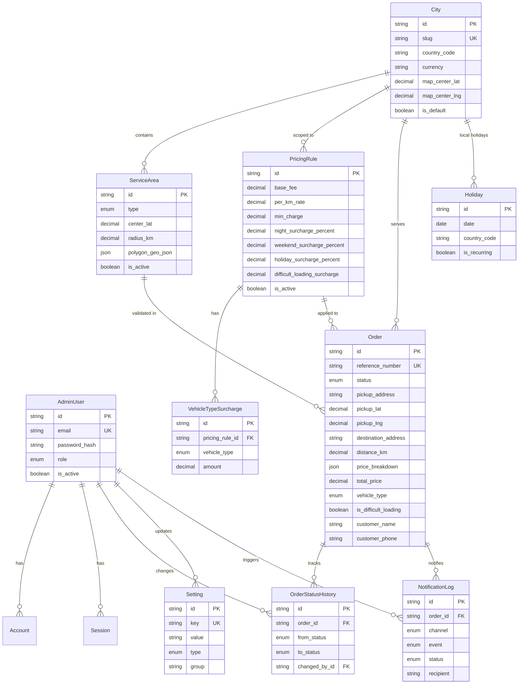

# Tow Truck Service Platform — Database Design

**Version:** 1.0  
**Status:** Draft — Pending Approval  
**Phase:** 4 — Database Design  
**Last Updated:** 2026-08-03  
**ORM:** Prisma 6 · **Engine:** PostgreSQL 16 (Neon)

---

## Table of Contents

1. [Overview](#1-overview)
2. [Entity Relationship Diagram](#2-entity-relationship-diagram)
3. [Enums](#3-enums)
4. [Entity Definitions](#4-entity-definitions)
5. [Relationships](#5-relationships)
6. [Indexes](#6-indexes)
7. [Constraints](#7-constraints)
8. [Migration Strategy](#8-migration-strategy)
9. [Seed Data](#9-seed-data)
10. [Design Decisions](#10-design-decisions)
11. [Future Extensibility](#11-future-extensibility)
12. [Approval Checklist](#12-approval-checklist)

---

## 1. Overview

The database supports a commercial tow truck ordering platform with:

- Customer order lifecycle management
- Flexible, admin-configurable pricing with full surcharge support
- Multi-channel notification audit trail
- Configurable branding and business settings (no hardcoded values)
- Geographic service area validation
- Admin authentication with OAuth-ready schema
- Country-independent design with Ukraine as the initial default

### Entity Summary

| Entity | Table | Purpose |
|--------|-------|---------|
| `AdminUser` | `admin_users` | Administrator accounts |
| `Account` | `accounts` | Auth.js OAuth provider accounts |
| `Session` | `sessions` | Auth.js database sessions (future) |
| `VerificationToken` | `verification_tokens` | Auth.js email verification |
| `City` | `cities` | Multi-city support (Kyiv default) |
| `ServiceArea` | `service_areas` | Geographic coverage zones |
| `PricingRule` | `pricing_rules` | Base pricing configuration |
| `VehicleTypeSurcharge` | `vehicle_type_surcharges` | Per-vehicle-type surcharges |
| `Holiday` | `holidays` | Public holidays for surcharge calculation |
| `Order` | `orders` | Customer tow requests |
| `OrderStatusHistory` | `order_status_history` | Order status audit trail |
| `NotificationLog` | `notification_logs` | Notification delivery audit trail |
| `Setting` | `settings` | Key-value application configuration |

**Total:** 14 models · 10 enums · 14 tables

---

## 2. Entity Relationship Diagram



### Relationship Cardinality

```
AdminUser  1 ──── * OrderStatusHistory
AdminUser  1 ──── * Setting
AdminUser  1 ──── * Account
AdminUser  1 ──── * Session
AdminUser  1 ──── * NotificationLog

City       1 ──── * ServiceArea
City       1 ──── * PricingRule
City       1 ──── * Order
City       1 ──── * Holiday

PricingRule 1 ─── * VehicleTypeSurcharge
PricingRule 1 ─── * Order

ServiceArea 1 ─── * Order

Order      1 ──── * OrderStatusHistory
Order      1 ──── * NotificationLog
```

---

## 3. Enums

### OrderStatus

Order lifecycle states. Transitions enforced in application layer.

| Value | Description |
|-------|-------------|
| `PENDING` | Newly submitted, awaiting admin confirmation |
| `CONFIRMED` | Admin confirmed, preparing dispatch |
| `DISPATCHED` | Tow truck assigned and en route to pickup |
| `IN_PROGRESS` | Vehicle being towed |
| `COMPLETED` | Service finished successfully |
| `CANCELLED` | Order cancelled by admin or customer |

**Valid transitions:**

```
PENDING → CONFIRMED → DISPATCHED → IN_PROGRESS → COMPLETED
PENDING → CANCELLED
CONFIRMED → CANCELLED
DISPATCHED → CANCELLED
```

### VehicleType

| Value | Ukrainian Label (UI) |
|-------|---------------------|
| `PASSENGER_CAR` | Легковий автомобіль |
| `SUV` | Кросовер / SUV |
| `VAN` | Мінівен / фургон |
| `TRUCK` | Вантажний автомобіль |
| `MOTORCYCLE` | Мотоцикл |
| `OTHER` | Інше |

### AdminRole

| Value | Permissions |
|-------|-------------|
| `SUPER_ADMIN` | Full access including user management |
| `ADMIN` | Full operational access |
| `DISPATCHER` | Order management, status updates |
| `VIEWER` | Read-only dashboard access |

### SettingType

| Value | Storage Format |
|-------|---------------|
| `STRING` | Plain text |
| `NUMBER` | Numeric string, parsed at runtime |
| `BOOLEAN` | `"true"` / `"false"` |
| `JSON` | JSON-encoded string |

### ServiceAreaType

| Value | Validation Method |
|-------|-------------------|
| `RADIUS` | Haversine distance from center point |
| `POLYGON` | Point-in-polygon against GeoJSON |

### SurchargeType

Used in `Order.priceBreakdown` JSON snapshot (not a database enum column).

| Value | Trigger |
|-------|---------|
| `VEHICLE_TYPE` | Vehicle type differs from base |
| `NIGHT` | Order time within night hours |
| `WEEKEND` | Saturday or Sunday |
| `HOLIDAY` | Date matches Holiday table |
| `DIFFICULT_LOADING` | Customer flagged difficult loading |
| `SERVICE_AREA` | Pickup outside standard zone |

### NotificationChannel / NotificationEvent / NotificationStatus

Aligned with the notification adapter architecture from Phase 2.

---

## 4. Entity Definitions

### 4.1 Order

The central entity. Stores a **complete immutable pricing snapshot** at order time so historical orders are never affected by future pricing changes.

**Reference number format:** `TT-YYYYMMDD-XXXX` (e.g., `TT-20260803-0001`)

**Price breakdown JSON structure:**

```json
{
  "baseFee": 500.00,
  "distanceKm": 12.5,
  "perKmRate": 25.00,
  "distanceFee": 312.50,
  "surcharges": [
    {
      "type": "VEHICLE_TYPE",
      "label": "SUV surcharge",
      "amount": 100.00
    },
    {
      "type": "NIGHT",
      "label": "Night surcharge (25%)",
      "amount": 228.13
    }
  ],
  "subtotal": 912.50,
  "minChargeApplied": false,
  "total": 912.50,
  "currency": "UAH",
  "calculatedAt": "2026-08-03T18:30:00.000Z"
}
```

**Future hooks (nullable, no FK yet):**

- `operatorId` — multi-operator dispatch
- `customerId` — customer accounts
- `metadata` — payments, GPS tracking, CRM references

### 4.2 PricingRule

One active rule per city at a time (enforced in application layer). Supports scheduled pricing via `validFrom` / `validTo`.

| Field | Type | Purpose |
|-------|------|---------|
| `baseFee` | Decimal(10,2) | Fixed call-out fee (UAH) |
| `perKmRate` | Decimal(10,2) | Rate per kilometer (UAH) |
| `minCharge` | Decimal(10,2) | Minimum total charge floor |
| `nightSurchargePercent` | Decimal(5,2) | % added during night hours |
| `nightStartHour` | Int | Night period start (0–23) |
| `nightEndHour` | Int | Night period end (0–23) |
| `weekendSurchargePercent` | Decimal(5,2) | % added on Sat/Sun |
| `holidaySurchargePercent` | Decimal(5,2) | % added on public holidays |
| `difficultLoadingSurcharge` | Decimal(10,2) | Fixed fee for difficult loading |

### 4.3 VehicleTypeSurcharge

Separate table (not JSON) for admin CRUD of per-vehicle surcharges. Unique constraint prevents duplicate entries per rule + vehicle type.

### 4.4 Holiday

Stores Ukrainian public holidays. `isRecurring: true` means the surcharge applies every year on that month/day regardless of the stored year.

**Holiday detection logic (application layer):**

```
isHoliday(date, countryCode, cityId) =
  EXISTS holiday WHERE
    countryCode = :countryCode
    AND (cityId = :cityId OR cityId IS NULL)
    AND (
      (isRecurring AND EXTRACT(MONTH FROM date) = EXTRACT(MONTH FROM holiday.date)
                   AND EXTRACT(DAY FROM date) = EXTRACT(DAY FROM holiday.date))
      OR (NOT isRecurring AND holiday.date = :date)
    )
```

### 4.5 ServiceArea

Supports two geometry types:

- **RADIUS:** `centerLat`, `centerLng`, `radiusKm` — simple circular zone
- **POLYGON:** `polygonGeoJson` — GeoJSON Polygon for irregular boundaries

PostGIS extension can be added later for native geospatial queries. At MVP, validation runs in the application layer.

### 4.6 Setting

Key-value store for all branding and configuration. Keys follow dot-notation namespacing:

| Group | Example Keys |
|-------|-------------|
| `branding` | `company.name`, `company.logo_url`, `branding.primary_color` |
| `contact` | `contact.phone`, `contact.whatsapp`, `contact.email` |
| `locale` | `locale.country_code`, `locale.language`, `locale.currency` |
| `maps` | `maps.center_lat`, `maps.center_lng`, `maps.zoom` |
| `business` | `business.working_hours` |

### 4.7 NotificationLog

Audit trail for every notification attempt. Enables admin visibility into delivery failures and retry logic.

### 4.8 City

Enables multi-city expansion without schema changes. Ukraine launch seeds Kyiv as `isDefault: true`. Additional cities (Lviv, Odesa, Kharkiv) are added as new rows.

---

## 5. Relationships

### Foreign Key Delete Behaviors

| Relationship | On Delete | Rationale |
|-------------|-----------|-----------|
| Order → City | `SetNull` | Preserve orders if city is deactivated |
| Order → ServiceArea | `SetNull` | Preserve orders if area is removed |
| Order → PricingRule | `SetNull` | Preserve orders if rule is deleted |
| OrderStatusHistory → Order | `Cascade` | History is meaningless without order |
| VehicleTypeSurcharge → PricingRule | `Cascade` | Surcharges belong to rule |
| Account/Session → AdminUser | `Cascade` | Auth data cleaned with user |
| All → AdminUser (audit) | `SetNull` | Preserve audit if admin deleted |

### Nullable Foreign Keys

Nullable FKs on `Order` are intentional design choices:

- Orders remain valid even if referenced configuration entities are later modified or removed
- Pricing snapshot in `priceBreakdown` JSON ensures financial record integrity

---

## 6. Indexes

### Performance-Critical Indexes

| Table | Index | Purpose |
|-------|-------|---------|
| `orders` | `(status, created_at DESC)` | Admin order list filtered by status |
| `orders` | `(created_at DESC)` | Chronological order feed |
| `orders` | `(customer_phone)` | Customer lookup / duplicate detection |
| `orders` | `(city_id, status)` | City-scoped admin views |
| `orders` | `(reference_number)` | Unique + fast lookup by reference |
| `order_status_history` | `(order_id, created_at DESC)` | Order detail timeline |
| `pricing_rules` | `(is_active, valid_from, valid_to)` | Active rule resolution |
| `pricing_rules` | `(city_id, is_active)` | City-specific rule lookup |
| `service_areas` | `(city_id, is_active)` | Active areas for city |
| `service_areas` | `(is_active, priority)` | Priority-ordered area matching |
| `holidays` | `(date, country_code)` | Holiday detection query |
| `notification_logs` | `(order_id, created_at DESC)` | Order notification history |
| `notification_logs` | `(status, created_at DESC)` | Failed notification retry queue |
| `settings` | `(key)` UNIQUE | O(1) setting lookup |
| `settings` | `(group)` | Grouped settings in admin UI |
| `admin_users` | `(email)` UNIQUE | Login lookup |
| `cities` | `(country_code, is_active)` | Country-scoped city list |
| `cities` | `(is_default)` | Default city resolution |

### Index Design Rationale

- **Composite `(status, created_at DESC)`** on orders — covers the most common admin query pattern (filter by status, sort newest first) in a single index scan.
- **No index on `pickup_lat/lng`** at MVP — geospatial queries run in application layer. PostGIS GIST index added when scaling to polygon-heavy queries.
- **`reference_number` unique index** — doubles as lookup index for customer confirmation pages.

---

## 7. Constraints

### Database-Level Constraints

| Constraint | Table | Implementation |
|-----------|-------|---------------|
| Unique email | `admin_users` | `@unique` on `email` |
| Unique reference number | `orders` | `@unique` on `reference_number` |
| Unique setting key | `settings` | `@unique` on `key` |
| Unique city slug | `cities` | `@unique` on `slug` |
| Unique vehicle surcharge per rule | `vehicle_type_surcharges` | `@@unique([pricingRuleId, vehicleType])` |
| Unique holiday per date/country/city | `holidays` | `@@unique([date, countryCode, cityId])` |
| Unique OAuth account | `accounts` | `@@unique([provider, providerAccountId])` |

### Application-Level Constraints (enforced in domain services)

| Rule | Validation |
|------|-----------|
| `totalPrice >= 0` | Pricing engine |
| `distanceKm >= 0` | Maps service + order creation |
| `minCharge >= baseFee` | Admin pricing form |
| `nightStartHour` in 0–23 | Admin pricing form |
| `customerPhone` E.164 format | Zod schema (+380...) |
| Order status transitions | Orders service state machine |
| One active pricing rule per city | Pricing service |
| `passwordHash` bcrypt only | Auth service — never store plaintext |

### Recommended PostgreSQL CHECK Constraints (Phase 8 migration)

These are documented for addition via raw SQL migration when implementing the backend:

```sql
ALTER TABLE orders ADD CONSTRAINT orders_total_price_non_negative
  CHECK (total_price >= 0);

ALTER TABLE orders ADD CONSTRAINT orders_distance_non_negative
  CHECK (distance_km >= 0);

ALTER TABLE pricing_rules ADD CONSTRAINT pricing_base_fee_non_negative
  CHECK (base_fee >= 0);

ALTER TABLE pricing_rules ADD CONSTRAINT pricing_night_hours_valid
  CHECK (night_start_hour BETWEEN 0 AND 23 AND night_end_hour BETWEEN 0 AND 23);
```

---

## 8. Migration Strategy

### Workflow

```
Developer modifies prisma/schema.prisma
        │
        ▼
npx prisma migrate dev --name descriptive_name    (local development)
        │
        ▼
Git commit: schema.prisma + prisma/migrations/    (version controlled)
        │
        ▼
PR merge → Vercel build → prisma migrate deploy   (production)
```

### Environment Strategy

| Environment | Database | Migration Command |
|------------|----------|-------------------|
| Local dev | Docker PostgreSQL or Neon branch | `prisma migrate dev` |
| Preview (PR) | Neon ephemeral branch | `prisma migrate deploy` |
| Production | Neon production | `prisma migrate deploy` |

### Initial Migration

Phase 4 approval triggers the first migration:

```bash
# After connecting DATABASE_URL
npx prisma migrate dev --name init
npx prisma db seed
```

This creates all 14 tables, 10 enum types, indexes, and foreign keys in a single initial migration.

### Migration Rules

1. **Never modify applied migrations** — create a new migration for every schema change.
2. **Never use `prisma db push` in production** — always use `migrate deploy`.
3. **Destructive changes require manual review** — column drops, type changes, data migrations.
4. **Backup before production migrations** — Neon point-in-time recovery or manual snapshot.
5. **Test migrations on Neon preview branch** — every PR gets an isolated database branch.

### Rollback Procedure

| Scenario | Action |
|----------|--------|
| Failed migration on deploy | Fix schema, create corrective migration, redeploy |
| Data corruption after migration | Neon PITR restore to pre-migration timestamp |
| Bad migration already applied | Create forward migration to undo changes (no `migrate down` in production) |

### CI Integration

The existing CI pipeline runs `prisma generate` on every PR. Phase 8 adds:

```yaml
- run: npx prisma migrate diff --exit-code --from-migrations prisma/migrations --to-schema-datamodel prisma/schema.prisma
```

This fails CI if schema changes exist without a corresponding migration file.

---

## 9. Seed Data

The seed script (`prisma/seed.ts`) populates development and staging environments with Ukraine-specific defaults.

### Seeded Entities

| Entity | Count | Details |
|--------|-------|---------|
| **City** | 1 | Kyiv (default, `Europe/Kyiv`, UAH) |
| **AdminUser** | 1 | `admin@example.com` / `ChangeMe123!` (SUPER_ADMIN) |
| **Setting** | 17 | All branding, contact, locale, maps keys (empty branding values) |
| **PricingRule** | 1 | Standard tariff with all surcharge types configured |
| **VehicleTypeSurcharge** | 6 | One surcharge per vehicle type |
| **ServiceArea** | 1 | Kyiv + 50 km radius |
| **Holiday** | 10 | Ukrainian public holidays (recurring) |

### Default Pricing (UAH, editable via Admin)

| Parameter | Value |
|-----------|-------|
| Base call-out fee | ₴500 |
| Per km rate | ₴25 |
| Minimum charge | ₴700 |
| Night surcharge | 25% (22:00–06:00) |
| Weekend surcharge | 15% |
| Holiday surcharge | 30% |
| Difficult loading | ₴300 fixed |
| SUV surcharge | ₴100 |
| Van surcharge | ₴200 |
| Truck surcharge | ₴400 |

### Running Seed

```bash
# Requires DATABASE_URL and applied migrations
npm run db:seed
```

Seed is **idempotent** — uses `upsert` for all records. Safe to run multiple times.

### Production Seed Policy

- Run seed **once** on initial production deployment only.
- Never re-run seed in production after launch (upserts could overwrite admin-configured values).
- Production admin password must be changed immediately after first login.

---

## 10. Design Decisions

### DD-01: Decimal for All Monetary Values

**Decision:** Use `Decimal(10, 2)` for all money fields, never `Float`.

**Why:** Floating-point arithmetic causes rounding errors (e.g., `0.1 + 0.2 ≠ 0.3`). Unacceptable for financial data. Prisma `Decimal` maps to PostgreSQL `NUMERIC` for exact precision.

---

### DD-02: Price Snapshot on Order (Immutable JSON)

**Decision:** Store complete `priceBreakdown` JSON on the Order at creation time.

**Why:** Pricing rules change over time. Historical orders must reflect the price the customer agreed to. Normalized pricing line items would require complex historical joins. JSON snapshot is simpler, immutable, and sufficient for display, export, and dispute resolution.

---

### DD-03: Separate VehicleTypeSurcharge Table

**Decision:** Vehicle type surcharges in their own table, not JSON on PricingRule.

**Why:** Admin dashboard needs CRUD per vehicle type with individual amounts. A normalized table enables form-based editing, validation, and unique constraints. JSON would require parsing and merge logic in the admin UI.

---

### DD-04: City Entity for Multi-City Readiness

**Decision:** Introduce `City` entity now, seed Kyiv as default.

**Why:** Architecture requires multi-city support without major refactoring. Nullable `cityId` on Order, PricingRule, ServiceArea, and Holiday allows country-wide or city-specific configuration. Adding Lviv later = one new City row, not a schema migration.

---

### DD-05: Settings as Key-Value Store

**Decision:** Single `Setting` table with dot-notation keys, not dedicated columns or JSON blob.

**Why:** Branding is under development and will change. New settings (e.g., `contact.telegram`, `seo.meta_description`) are added without migrations. Admin UI groups by `group` field. Typed getters in SettingsService provide type safety at the application layer.

---

### DD-06: Auth.js Adapter Models Included

**Decision:** Include `Account`, `Session`, `VerificationToken` tables despite JWT-only MVP.

**Why:** Approved architecture requires Google OAuth in the future without refactoring. Adding these tables now costs nothing (empty tables) and prevents a breaking migration when OAuth is enabled. Auth.js Prisma adapter works out of the box.

---

### DD-07: NotificationLog for Audit, Not Queue

**Decision:** `NotificationLog` records delivery attempts; it is not a job queue.

**Why:** At MVP scale, notifications are fire-and-forget from the order creation flow. The log provides admin visibility and retry data. When volume requires it, a dedicated job queue (Inngest/Trigger.dev) is added without replacing the audit log.

---

### DD-08: Holiday Table with isRecurring Flag

**Decision:** Store holidays as dates with `isRecurring: true` for annual holidays.

**Why:** Ukrainian public holidays repeat annually on the same date. Storing one row per holiday (not one per year) keeps the table small and admin-manageable. The pricing engine matches by month/day when `isRecurring` is true.

---

### DD-09: cuid() for Primary Keys

**Decision:** Use `cuid()` for all primary keys, not UUID v4 or auto-increment.

**Why:** CUIDs are URL-safe, sortable by creation time, collision-resistant, and require no database sequence coordination. Better for distributed/serverless environments than auto-increment. More compact in URLs than UUIDs.

---

### DD-10: snake_case Column Names in Database

**Decision:** Prisma `@map("snake_case")` for all multi-word columns and `@@map` for table names.

**Why:** PostgreSQL convention is snake_case. TypeScript/Prisma client uses camelCase. Explicit mapping gives both conventions without ambiguity in raw SQL queries, exports, and analytics tools.

---

### DD-11: Soft Scalability Hooks on Order

**Decision:** `operatorId`, `customerId`, and `metadata` JSON on Order — nullable, no FK constraints yet.

**Why:** Future features (operators, customer accounts, payments, GPS) need a place to store data. Nullable columns with JSON metadata avoid premature FK constraints and tables for features not yet built. FK constraints added when the feature ships.

---

### DD-12: No PostGIS at MVP

**Decision:** Store polygon as GeoJSON in JSON column; radius as lat/lng + km. Application-layer validation.

**Why:** PostGIS adds extension management complexity on Neon. For MVP with one circular service area, Haversine distance is sufficient. PostGIS GIST indexes added when polygon-heavy multi-city geofencing is required.

---

## 11. Future Extensibility

| Future Feature | Schema Hook | Migration Required |
|---------------|-------------|-------------------|
| Customer accounts | `Order.customerId` → new `Customer` table | Yes — add FK |
| Multi-operator | `Order.operatorId` → new `Operator` table | Yes — add FK |
| Online payments | `Order.metadata.paymentId` or new `Payment` table | Yes |
| Live GPS tracking | `Order.metadata.trackingSessionId` or new table | Yes |
| SMS notifications | No schema change — new adapter + NotificationLog channel | No |
| PostGIS geospatial | `ALTER EXTENSION postgis` + GIST index | Yes — extension |
| Multi-language content | New `ContentTranslation` table | Yes |
| Order attachments | New `OrderAttachment` table + Vercel Blob URL | Yes |
| CRM integration | `Order.metadata.crmId` | No |

---

## 12. Approval Checklist

Before proceeding to Phase 5 (API Specification), please confirm:

- [ ] Entity design and relationships approved
- [ ] All 10 enums approved
- [ ] Pricing model schema supports all required surcharge types
- [ ] Order price snapshot approach approved
- [ ] City entity for multi-city readiness approved
- [ ] Settings key-value architecture approved
- [ ] Auth.js adapter models (OAuth-ready) approved
- [ ] Index strategy approved
- [ ] Migration strategy approved
- [ ] Seed data defaults approved (pricing values, holidays, Kyiv service area)
- [ ] Any entities to add, remove, or modify

---

## Files Delivered

| File | Purpose |
|------|---------|
| `prisma/schema.prisma` | Complete Prisma schema (14 models, 10 enums) |
| `prisma/seed.ts` | Idempotent Ukraine-default seed script |
| `docs/DATABASE.md` | This document |

**Note:** Migration files (`prisma/migrations/`) are generated upon first `prisma migrate dev` after DATABASE_URL is configured — not included in Phase 4 documentation deliverable.

---

*This document is the authoritative database reference. All API and service implementations in subsequent phases must align with this schema unless revised via a documented migration.*
